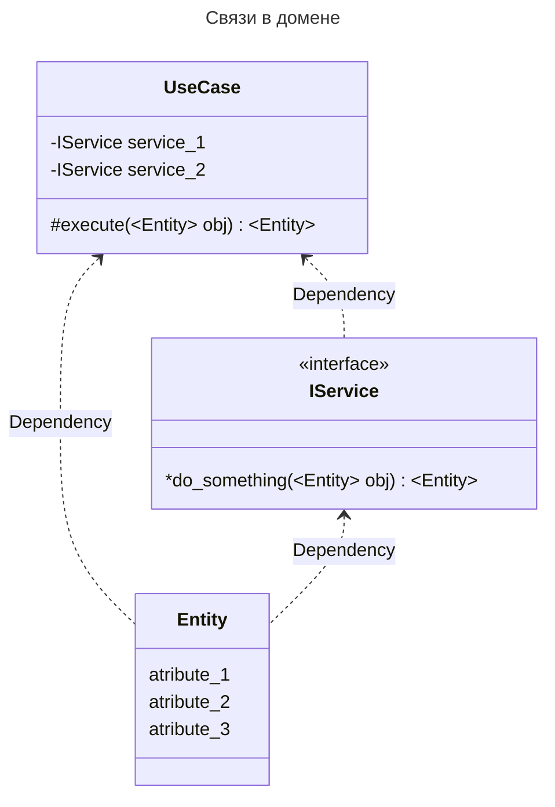

# Структура FastAPI приложений

## Введение
В эффективной разработке программного обеспечения структура проекта играет ключевую роль. Она не только облегчает навигацию по проекту, упрощает добавление новых функций и обслуживание существующего кода, но и способствует улучшению сотрудничества в команде и повышению качества конечного продукта.

**Цель** - Предоставить четкие рекомендации и лучшие практики по структурированию приложений FastAPI. Как разделить ваш проект на логические модули, где и как лучше размещать определенные типы файлов и директорий, а также как поддерживать чистоту и порядок в вашей кодовой базе.

Эта структура предназначена не только для улучшения текущей работы над проектом, но и для обеспечения его масштабируемости в будущем. Она поможет новым членам команды быстрее адаптироваться в проекте, а также упростит процесс ревью кода и тестирования.

Следуя предложенным рекомендациям, вы сможете создать мощное и гибкое приложение, которое не только отвечает современным требованиям к разработке, но и является удобным для работы в команде разработчиков разного уровня квалификации.

```
├── app
│   ├── admin
│   │   └── ...
│   ├── api
│   │   └── {{ api_name }}  # Например v1 | v2 | internal | graphql | jsonrpc
│   │       ├── views
│   │       │   └──  ...
│   │       ├── schemas
│   │       │   └──  ...
│   │       └── router.py
│   ├── core
│   │   ├── config
│   │   │   ├── general.py
│   │   │   └── ...
│   │   └── containers.py
│   ├── domain
│   │   └── {{ sub_domain }}
│   │       ├── entities
│   │       │   └── ...
│   │       ├── exceptions
│   │       │   └── ...
│   │       ├── services
│   │       │   └── ...
│   │       └── use_cases
│   │           └── ...
│   ├── gateways
│   │   └── {{ gateway_name }}
│   │       └── ...
│   ├── helpers
│   │   └── ...
│   ├── services
│   │   └── ...
│   ├── workers
│   │    └── ...
│   └── main.py
├── tests
│   ├── conftest.py
│   ├── domain
│   │   └── ...
│   ├── factories.py
│   ├── gateways
│   │   └── ...
│   ├── helpers.py
│   └── services
│       └── ...
├── poetry.lock
└── pyproject.toml
```

### Domain
Центральная часть вашего приложения, содержащая бизнес-логику и бизнес-модели. Этот слой отвечает за представление концепций домена и их связей специфичных для предметной области проекта.



#### Entities
Описывают основные доменные объекты, их свойства. Энтити служат представлением вашего бизнес-модели и её ключевых атрибутов.

#### Exceptions
Специфические исключения домена, которые могут возникать в процессе выполнения бизнес-логики. Использование кастомных исключений упрощает обработку ошибок и повышает читаемость кода.

#### Services
Сервисы домена только **описывают интерфейсы** сложной бизнес-логики, оперируя сущностями (entities) и ошибками (exceptions). Это слой, описывает атомарные операции с сущностями бизнеса. Принимает на вход только сущности (entities) или стандартные типы данных и возвращает только сущности (entities) или доменные ошибки (exceptions).

#### Use Cases
Описывают конкретные сценарии использования или потоки выполнения бизнес-операций, ориентированные на достижение конкретных целей пользователями или системой.

### Gateways
### Services
### API
### Workers
### Core
### Admin
### Helpers